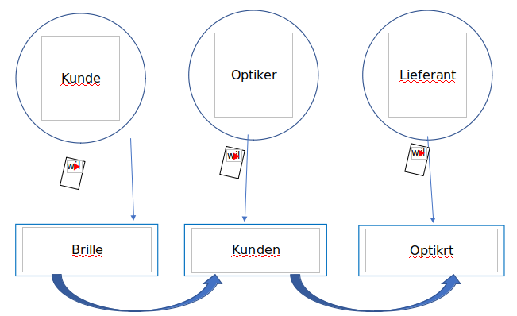

# Optikfried

# Ziel
 
Jeder Onlineanfrage nach Brillen Kaufen soll über unsere Webseite gehen.

## Slogan

Wir bringen zu jedem seiner Bedarf 

## Workflow

* Wenn der User sucht in Internet nach Brille zu kaufen soll er auf unsere Webseite kommen und nach die Brillen suchen. Er soll dann eine Liste mit alle Optiker die diese Brille haben gezeigt bekommen.(Liste oder Landkarte) er kann die nach PLZ und andere Kriterien sortieren.
* Dann kann er eine Optiker oder online Shop aus die Liste auswählen und bei denen die Brille bestellen und geliefert bekommen oder abholen. 
* Das alles soll über uns laufen als eine Vermittlung Plattform zwischen der User und Optiker. 
* Der Optiker bekommt eine Nachricht dass ein potenzieller Käufer Brille sucht und dann soll er der kauf nehmen bzw. mit anbieten und auf eine Bestätigung vom Käufer warten.
* Der Zahlungen soll auch über uns laufen und wir ziehen ein Bearbeitungsgebühr vom Betrag ab.  Der Betrag Minus Gebühr zahlen wir der Optiker.
* Auf der Website sollte auch die Möglichkeit gegeben dass der User mit der Optiker kommunizieren kann.
* Wenn die Plattform zwischen der End User  und der Optiker fertig ist gehen wir auf die Plattform zwischen der Optiker und die Lieferanten an.

# Links
 
* [MyDot Mockup](https://balsamiq.cloud/sxtv712/phyabhm)

